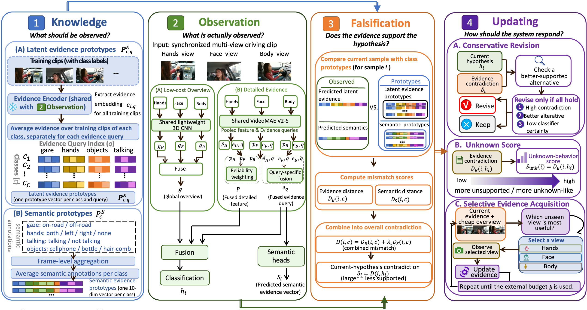
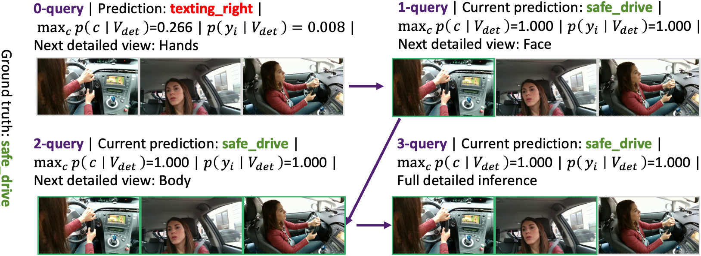
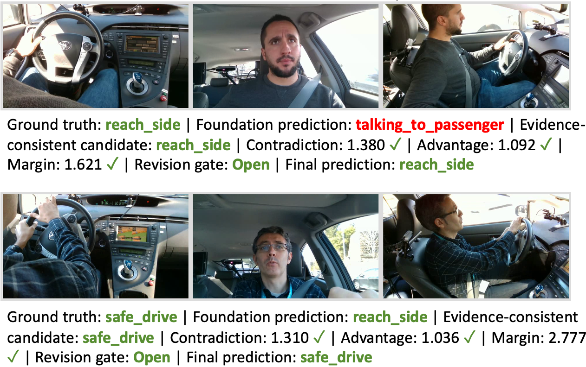

# KOFU: Evidence-Consistent Multi-View Driver Monitoring

This repository provides the anonymous implementation of **KOFU**, an evidence-consistent multi-view driver monitoring framework.

The code is released for anonymous review and reproducibility.

## Overview

KOFU studies how multi-view driver monitoring systems can improve prediction reliability by explicitly modeling the consistency between observed visual evidence and predicted behaviors.

The framework contains four main components:

1. **Evidence construction**
   - Learning class-conditional evidence representations from training data.
   - Modeling latent and semantic evidence.

2. **Multi-view observation**
   - Extracting evidence from synchronized driver views.
   - Combining complementary visual information.

3. **Evidence consistency analysis**
   - Comparing observed evidence with expected class evidence.
   - Measuring evidence contradiction.

4. **Evidence-guided updating**
   - Revising unsupported predictions.
   - Detecting unknown behaviors.
   - Selecting additional observations under limited budgets.



---

## Repository Structure

After cloning this repository:

```text
kofu/
├── kofu_reproduction.py
├── dmd_evidms_final_split_v1/
├── architecture.png
├── query.png
└── revise.png
```

---

## Dataset Preparation

KOFU is evaluated on the Driver Monitoring Dataset (DMD).

The dataset can be downloaded from the official repository:

https://github.com/Vicomtech/DMD-Driver-Monitoring-Dataset

After downloading and extracting the dataset, organize the files as follows:

```text
workspace/
├── kofu/
│   ├── kofu_reproduction.py
│   └── dmd_evidms_final_split_v1/
│
└── dataset/
    └── DMD_distraction_extracted/
```

The dataset directory should contain the extracted DMD distraction data required by the code.

---

## Evaluation Split

The evaluation split used in this repository is provided in:

```text
dmd_evidms_final_split_v1/
```

The split folder should remain under the repository root:

```text
kofu/
├── kofu_reproduction.py
└── dmd_evidms_final_split_v1/
```

---

## Running the Code

After preparing the dataset and evaluation split, run:

```bash
python kofu_reproduction.py
```

The script executes the complete evaluation pipeline, including:

- loading the DMD multi-view data,
- applying the predefined split,
- extracting multi-view evidence,
- performing evidence consistency analysis,
- producing evaluation results.

---

## Visualization

### Framework Overview


### Evidence Query



### Evidence-based Revision



---

## Output

The script automatically generates the evaluation outputs required for reproducing the reported results.
